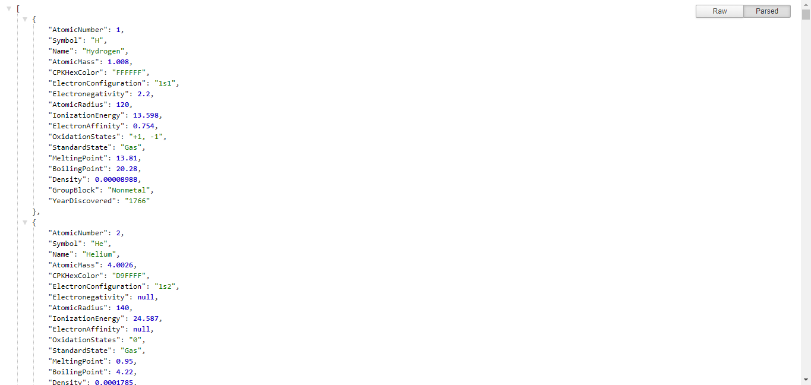

# Chemical Elements API
This is an api I built that serves data about chemical elements. You can get all the elements from the periodic table, or just one requesting it by its atomic number.

**Link to project:** https://chemical-elements-api.herokuapp.com/

## How It's Made:

**Tech used:** Node.js, Express, HTML5, CSS3, Bootstrap

## Optimizations

In the future I would like more ways to request the data, not only by atomic number and I would also like to add to each element a like to an image of it.

